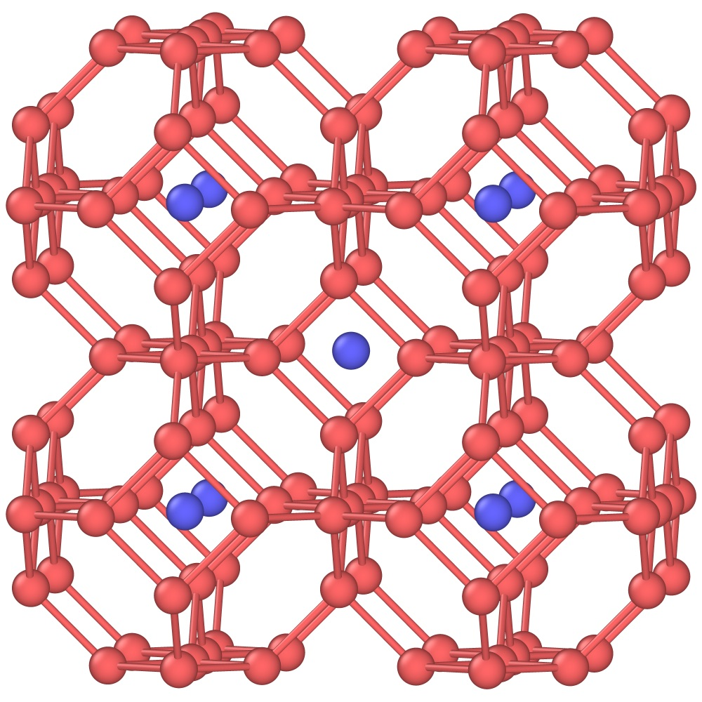

<!--  -->

#  A demo for inverse design of SOD zeolite framework


This repository is a demo for zeolite inverse design for the simplest zeolite, SOD framework.

## File structure
- `envs` is a directory to put in `unique environments` files. Here we already added 6 unique environments of SOD. You can extract these environments files for your desired frameworks using [EnvironmentFinder](https://github.com/PabloPiaggi/EnvironmentFinder).
  > If there is a problem when running `environmentfinder`, you could `cat \path\to\environmentfinder`, you will see
  ```
  #!/bin/bash

  location=`pip show environmentfinder | grep "Location" | awk '{print $2}'`

  voila $location/environmentfinder/App.ipynb --VoilaConfiguration.file_whitelist="['.*download.zip']"
  ```
  Then you can change `file_whitelist` to `file_allowlist` with vim, this should fix the issue.
- `inverse_design.py` is the main script to run the inverse design workflow. Please change the job submission format to match your job system.
- `sod_seed_23.data` is the seed file used in the bias simulations.
- `self_assembly.py` is to run self-assembly simulations. You could modify the criteria to screen the high-fitness solutions.

## Requirements

The simulation relies on the `LAMMPS` software and the `PLUMED` package. There are two dependencies from the Python script:

- numpy
- [cma](https://github.com/CMA-ES/pycma) 

To install cma (CMA-ES)

with pip:

    python -m pip install cma


with conda:

    conda install --channel cma-es cma


## Usage

Add `python inverse_design.py` command line in your submitting script, depending on which job system is used in your cluster. Here, we use the `slurm` job system as an example. Run it by:

`sbatch job.sh`

Once you get nice high-fitness solutions, you can run the self-assembly simulations by:

`python self_assembly.py`
